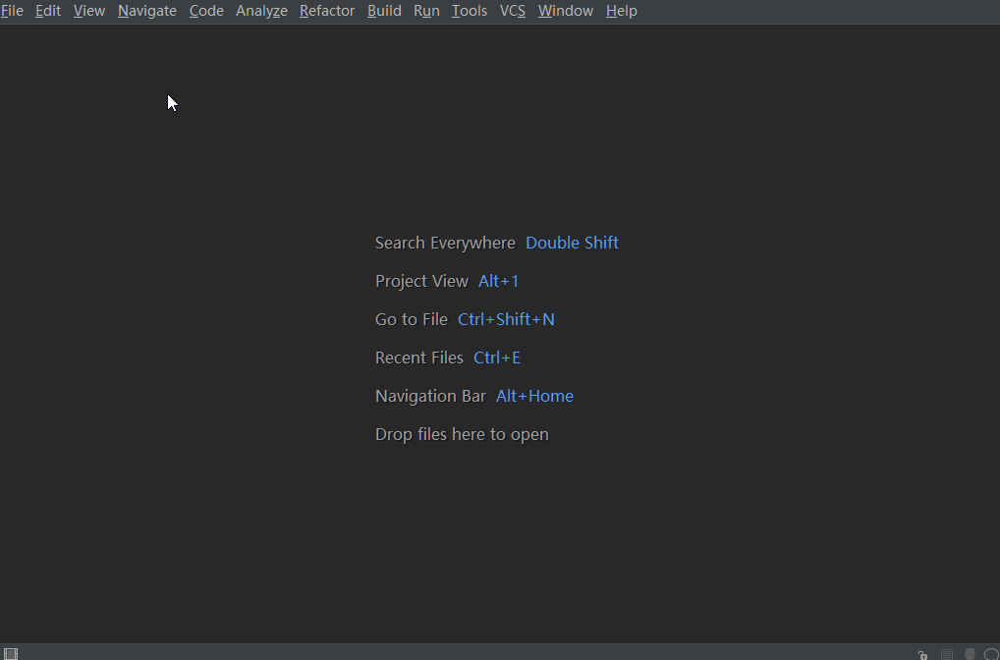
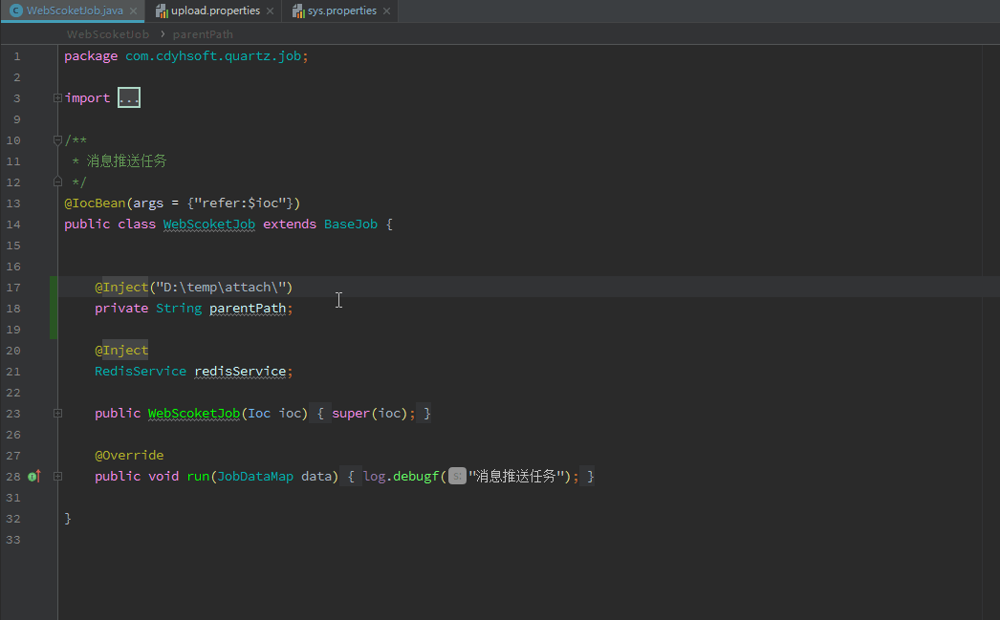
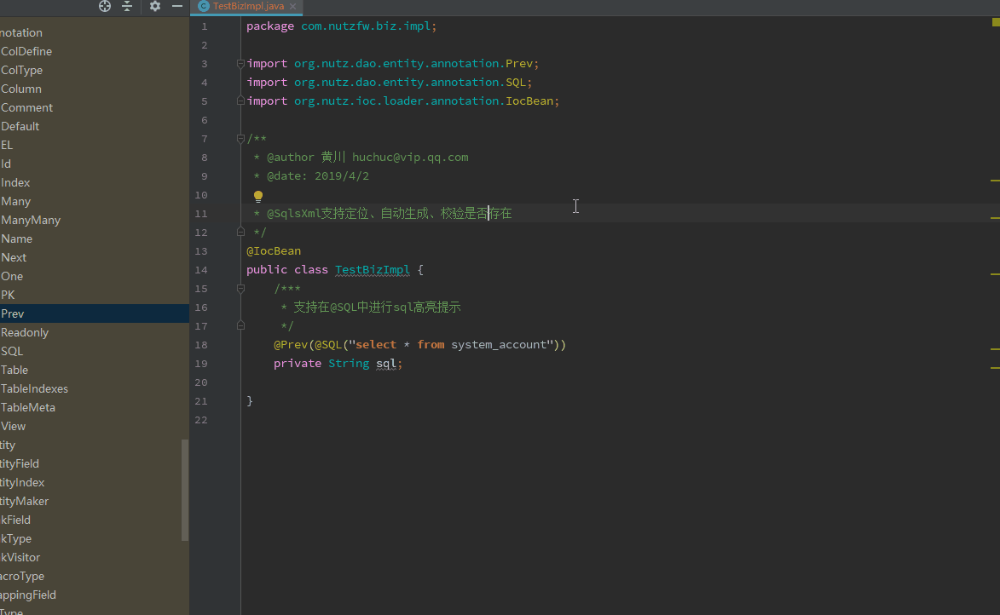

# NutzCodeInsight
- 1、支持NutzBoot项目快速搭建
- 2、在 Nutz Action 中点击 @Ok 前面的模版图标即可快速打开或切换至已经打开的模版文件
- 3、支持以HTML、JSP等格式文件作为模版的框架资源文件的快速定位（支持动态配置）
- 4、Navigate菜单中增加查找@At映射地址快捷方式
- 5、Nutz web环境中支持折叠显示国际化配置文件变量值（快捷键：Alt++或Alt+-）
- 6、Beetl模版中也支持国际化配置文件折叠(${i18n("login.sucess")}或者${i18n("login.sucess","参数1","参数N")} )（快捷键：Alt++或Alt+-）
- 7、Nutz 支持折叠显示java类中注入配置文件变量值 @Inject("java:$conf.get('attach.savePath')")（快捷键：Alt++或Alt+-）
- 8、@Inject("java:$conf.get('attach.savePath')") 可以通过 ctrl+click 或 ctrl+b 在java文件与配置文件中互相跳转
- 9、支持实体类中快速创建接口与实现类（快捷键：Alt+insert）
- 10、@SQL中的sql支持动态语言高亮和提示
- 11、<a href="https://github.com/threefish/nutz-sqltpl">Nutz-sqltpl</a> xml中的SQL模板中sql语言的动态高亮和提示
- 12、<a href="https://github.com/threefish/nutz-sqltpl">Nutz-sqltpl</a> 支持xml与java文件互相跳转
- 13、<a href="https://github.com/threefish/nutz-sqltpl">Nutz-sqltpl</a> 为还未创建xml模板文件的@SqlsXml注解快速生成对应xml模板 （快捷键：Alt+insert）
- 14、为@Inject字段注入接口提供快速跳转至实现类或选择多个实现类
- 14、为@OK("json")提供GUI并快速修改json格式化信息

>idea插件仓库[https://plugins.jetbrains.com/plugin/10311-nutzcodeinsight](https://plugins.jetbrains.com/plugin/10311-nutzcodeinsight "真实项目")

### 添加自定义配置
 - File >> Settings >> NutzCodeInsight
 - File >> Settings >> Other Settings >> NutzCodeInsight

# 安装后效果








#### 如果觉得好用，开发效率提高了，欢迎捐赠，以资鼓励，我会增加更多强大的功能哦
###### donation


- 1 在 Nutz Action 中点击 @Ok 前面的模版图标即可快速打开或切换至已经打开的模版文件
```java
  //模式1  jsp模版（默认支持）
  @Ok("jsp:btl.demo.manager")
  //模式2  beetl模版 （默认支持）
  @Ok("btl:btl.demo.manager")
  @Ok("beetl:btl.demo.manager")
  //模式3 （适用于改造后得视图返回器，我自己使用的） 
  @Ok("btl:WEB-INF/btl/demo/manager.html")
```
- 2 支持以HTML、JSP等格式文件作为模版的框架资源文件的快速定位（支持动态配置）
```jsp
 <link rel="stylesheet" href="${base}/static/plugins/bootstrap/css/bootstrap.min.css?_=${productVersion}">
 <script src="${base}/static/plugins/jquery/jQuery-2.1.4.min.js"></script>
```
#### 4 持以HTML、JSP等格式文件作为页面模版得资源文件的快速定位(将光标移至 "login.sucess" 中任意位置 使用快捷键(展开：ctrl+ 收起：ctrl-))
```java
    MvcI18n.message("login.sucess");
    MvcI18n.messageOrDefault("login.sucess","登录成功");
    MvcI18n.messageOrDefaultFormat("login.sucess","{0}帐号登录{1}","test","失败");//test帐号登录失败
    Mvcs.getMessage(Mvcs.getReq(),"login.sucess");
```